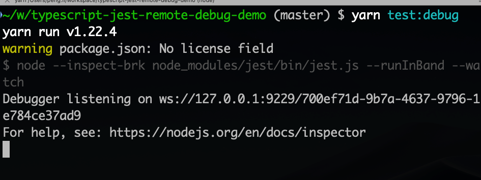
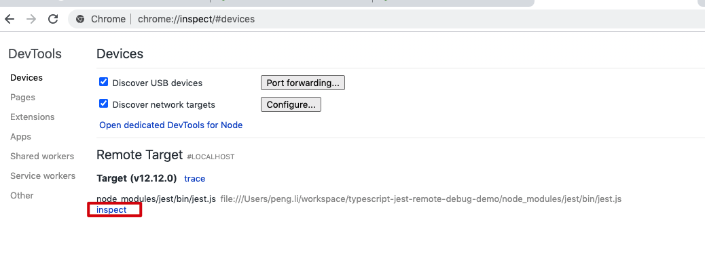
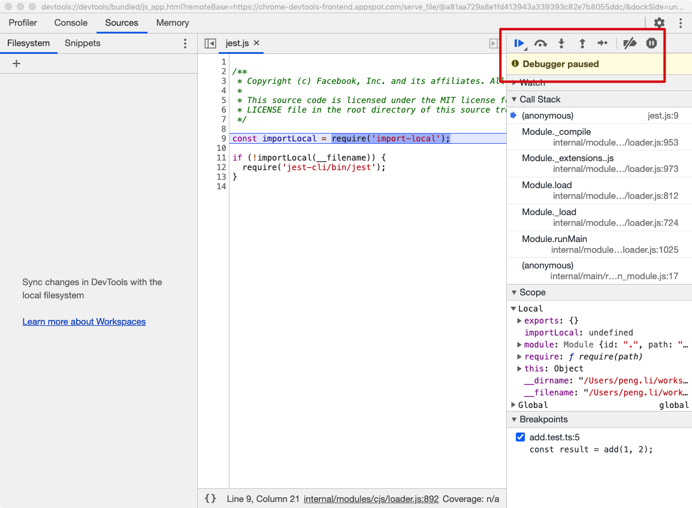
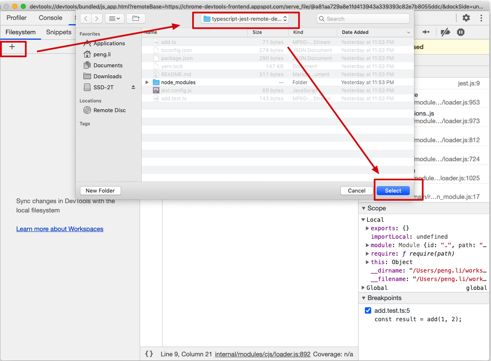
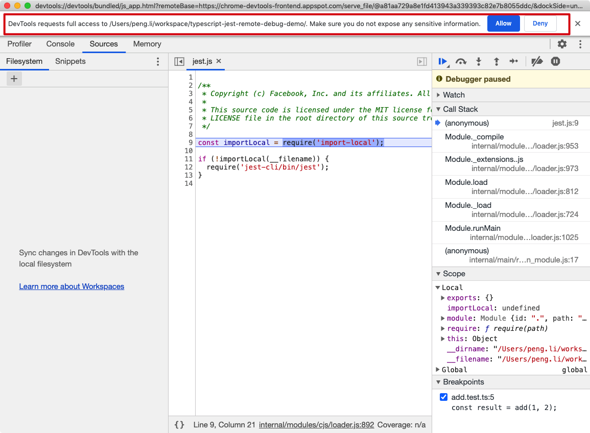
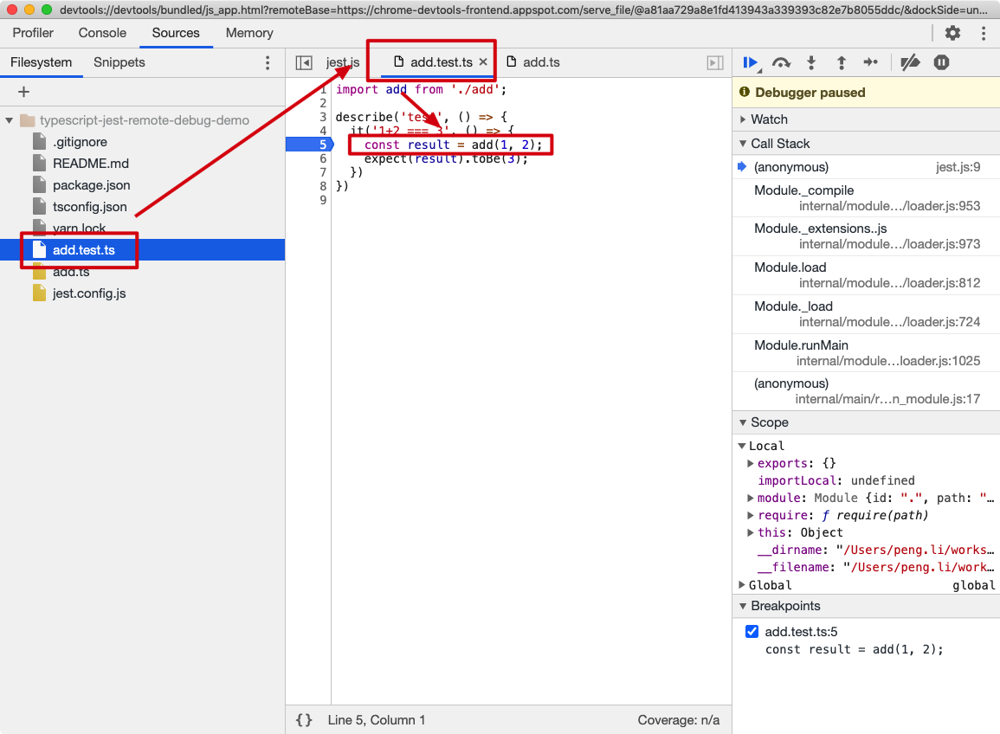
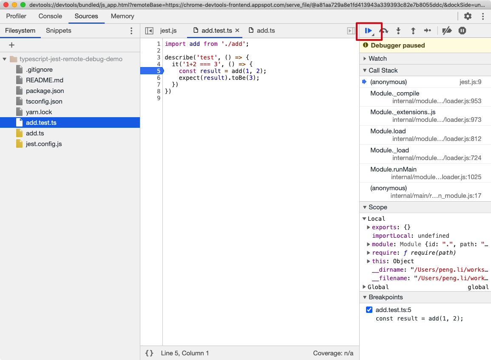

TypeScript Jest Remote Debug Demo
===========================

可以使用node的`--inspect-brk`选项，让测试代码在运行时暂停，并监听某个地址和端口。
然后使用某些远程debug工具（比如chrome），上来设置断点，并单步执行。

整个过程比较简单，可以作为调试的最后手段。

```
npm install
npm test:watch
```

运行上面的命令后，命令行上的测试会处于暂停并等待接入状态。会有一些url信息供远程调试工具使用：


打开chrome，在地址栏输入`chrome://inspect`，会打开chrome中自带的远程调试工具。


它实际上已经自动发现了可供调试的进程，我们只需要点击"inspect"链接，会自动打开下面中的调试工具：


可以看到代码处于暂停状态。

为了调试我们的代码，需要在Sources -> Filesystem下，把测试源代码加入：


选择包含测试的目录即可，直接支持typescript!

它会有一些安全确认，点击"Allow":


找到我们想设置断点的文件和行，点击行号设置断点：


在右方点击“继续运行”按钮，会运行到我们的断点处：


此时我们可以使用“单步调试”按钮等，也可以查看某些变量的状态：

